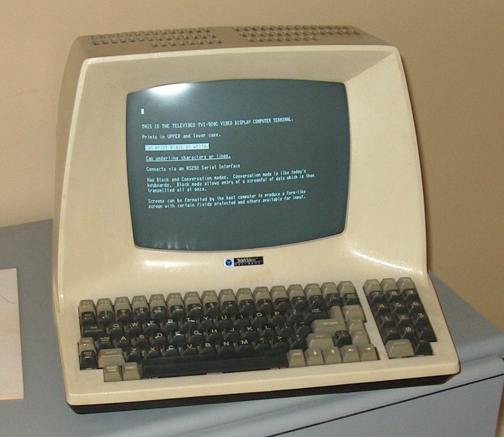

# 02 - Básico

## Conteúdo do artigo

[Terminal](##Terminal)<br>
[Console](##Console)<br>
[Emulador de Terminal](#emulador)<br>
[Shell](##Shell)<br>
[Linha de comandos - CLI](#cli)<br>
[Referências](#Referências)<br>
[Autores](#Autores)

----

Antes de entendermos o que é uma linha de comandos é importante nós entendermos os conceitos:

## Terminal

O terminal é um ambiente para entrada e saída de comandos, a palavra terminal também pode significar um dispositivo no qual podemos interagir com o computador, como por exemplo um teclado e monitor. No caso do terminal que estamos habituados ele é um software que emula os terminais tradicionais.

Exemplo de um terminal tradicional:



## Console

O console é um tipo especial de terminal. Geralmente é um painel de controle conectado a um computador. Originalmente um console é um dispositivo eletrônico no qual nos permite controlar um computador, por meio de entrada de texto e saída de vídeo.

Exemplo de um console tradicional:


No linux, nós também temos o console porém geralmente acessamos o console quando temos uma distribuição no modo texto, ou seja, sem interface gráfica.

<h2 id="emulador"> Emulador de terminal </h2>

Os terminais em software, também podem ser chamados de pseudo-terminais ou terminais virtuais, são softwares fornecidos por programas, específicos, que são do tipo *emulador de terminais*, alguns exemplos deles são:

* Xterm
* Konsole
* Gnome Terminal
* Terminator
* Termux
* Sakura

## Shell

O shell é um interpretador de linha de comandos. É a interface primária que nós vemos, caso o sistema não possuir interface gráfica, ao fazermos login, e sua função básica é iniciar outros programas e executar comandos. Quando estamos falando de linux, o shell se refere a *shell de linha de comandos*, alguns exemplos de shells comuns no linux:

* Bash
* csh
* zsh
* fish

> <h2 id="cli">Linha de comandos - CLI</h2>

Uma linha de comandos, ou CLI que é um acrônimo para *command line interface*, é uma interface na qual nós podemos digitar comandos e pressionarmos alguma tecla para que o comando seja, de fato, executado. Ou seja, na linha de comando nós não temos botões, menus, mouse, atalhos entre outros itens que possam ser clicados com o mouse.

Exemplo de uma linha de comando:

```console
lucashe4rt@He4rt-PC:~$
```

Quando pressionamos a tecla que faça o nosso comando ser executado, geralmente a tecla `enter`, o shell captura esse comando, interpreta e executa adequadamente.

Agora que vimos o que é uma linha de comando e o que é um shell, vamos entender quais são suas diferenças, já que os dois são bem semelhantes.

## Shell vs Linha de comandos

A *linha de comandos* não passa de uma interface, na qual, nós escrevemos os comandos. Já o *shell* é um programa especial que consegue interpretar esse comandos que estamos digitando.

----

## Referências

[Bóson Treinamentos - O que são Terminal, Console, Shell e CLI](https://www.youtube.com/watch?v=gItWfeDMLVg&list=PLucm8g_ezqNqz-DVT9n_z-XjRkQ03m7U5&index=10&t=0s) - Video

## Autores

* **Lucas Silva (LucasHe4rt)** - *Back-end Developer & Member of He4rt Developers* - [Twitter](https://twitter.com/lucashe4rt)
