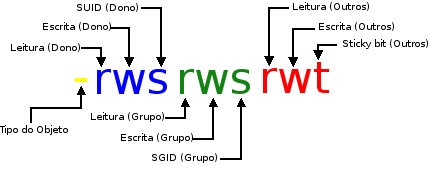

# 03 - Permissões especiais

## Contéudo do artigo

[Introdução](#Introdução)<br>
[SUID](#suid)<br>
[SGID](#sgid)<br>
[Sticky](#sticky)<br>
[Referências](#Referências)<br>
[Autores](#Autores)

---

> ### Introdução

Somente as permissões básicas não dão toda a flexibilidade que precisamos para controlar o acesso a diretórios e arquivos, por este motivo nós temos mais três modelos especiais de permissões para o controle de acesso, o **suid** (set user id), **sgid** e **Sticky** (Sticky bit).

Exemplo de permissão especial



> ### <span id="suid">SUID (Set User ID)</span>

O *SUID* é utilizado somente para arquivos executaveis e não se aplica a diretórios.

Nas permissões básicas, o usuário que executou o programa é dono do processo. Mas em arquivo executável com a propriedade SUID aplicada, o programa rodará com o ID do dono do arquivo, não com o ID do usuário que executou o programa.

A permissão de acesso especial SUID pode aparecer somente no campo Dono.

Um exemplo de um arquivo executavel com a propriedade SUID é o arquivo */usr/bin/passwd*.

```console
lucashe4rt@He4rt-PC:~$ ls -lah /usr/bin/passwd
-rwsr-xr-x 1 root root 63K Feb  4 09:31 /usr/bin/passwd
```

Ou seja, quando executamos o comando passwd com qualquer usuário normal, o processo é executado com ID do usuário root (como se o usuário root tivesse executado o comando passwd), pois somente o usuário root tem permissão para alterar o arquivo /etc/passwd.

#### Aplicando o SUID

#### Formato Literal

```console
lucashe4rt@He4rt-PC:~$ sudo chmod u+s arquivo.txt
lucashe4rt@He4rt-PC:~$ ls -lah arquivo.txt
-rws-----x 1 root root 0 Mar 17 21:57 arquivo.txt
```

#### Formato Octal (4)

```console
lucashe4rt@He4rt-PC:~$ sudo chmod 4750 arquivo.txt
lucashe4rt@He4rt-PC:~$ ls -lah arquivo.txt
-rwsr-x--- 1 root root 0 Mar 17 21:57 arquivo.txt
```

No exemplo acima nós atribuimos a propriedade SUID (4), seguido de todas as permissões para o dono (7), leitura e execução para o grupo (5) e nenhuma permissão para os outros usuários (0).

#### Retirando o SUID

#### Formato Literal

```console
lucashe4rt@He4rt-PC:~$ sudo chmod u-s arquivo.txt
lucashe4rt@He4rt-PC:~$ ls -lah arquivo.txt
-rwxr-x--- 1 root root 0 Mar 17 21:57 arquivo.txt
```

#### Formato Octal

```console
lucashe4rt@He4rt-PC:~$ sudo chmod 0750 arquivo.txt
lucashe4rt@He4rt-PC:~$ ls -lah arquivo.txt
-rwxr-x--- 1 root root 0 Mar 17 21:57 arquivo.txt
```

> ### <span id="sgid"> SGID (Set Group ID) </span>

O **SGID** E o SUID tem a mesma função porém o **SGID** quando é aplicado em um diretório, os novos arquivos que são criados dentro do diretório assumem o mesmo ID de Grupo do diretório com a propriedade SGID aplicado.

A permissão de acesso especial *SGID* pode aparecer somente no campo Grupo.

Por exemplo, se no diretório *home* de algum usuário pertencer ao grupo "noobs" e ter o *SGID* habilitado, todos os arquivos dentro da *home* do usuário serão criados com o grupo "noob".

#### Aplicando o SGID

#### Formato Literal

```console
lucashe4rt@He4rt-PC:~$ sudo chmod g+s Desktop/
lucashe4rt@He4rt-PC:~$ ls -lah Desktop/
drwxrwsr-x  2 lucashe4rt lucashe4rt 4.0K Mar 15 17:29 .
```

*Obs: como sabemos o caractér ponto (**.**) representa o diretório corrente, então como estamos listando o conteúdo de desktop o ponto significa o diretório desktop.*

#### Formato Octal (2)

```console
lucashe4rt@He4rt-PC:~$ sudo chmod 2750 Desktop/
lucashe4rt@He4rt-PC:~$ ls -lah Desktop/
drwxr-s---  2 lucashe4rt lucashe4rt 4.0K Mar 15 17:29 .
```

No exemplo acima nós atribuimos a propriedade SGID (2), seguido de todas as permissões para o dono (7), leitura e execução para o grupo (5) e nenhuma permissão para os outros usuários (0).

#### Retirando o SGID

```console
lucashe4rt@He4rt-PC:~$ sudo chmod g-s Desktop/
lucashe4rt@He4rt-PC:~$ ls -lah Desktop/
drwxr-x---  2 lucashe4rt lucashe4rt 4.0K Mar 15 17:29 .
```

> ### <span id="sticky"> Sticky (Sticky bit) </span>

A propriedade **Sticky**, em arquivos executaveis, faz com que o sistema mantenha uma imagem do programa em memória depois que o programa finalizar. Isso aumenta o desempenho, pois é feito um cache em memória então da próxima que o programa for executado será carregado mais rápido.

Em diretórios, a propriedade Sticky impede que outros usuários deletem ou renomeam arquivos dos quais não são donos, isto normalmente é utilizado para aumentar a segurança, pois o diretório estará em modo de somente incrementação assim só o dono do arquivo tem permissão para deletar, mover, renomear os arquivos dentro de um diretório com a propriedade Sticky aplicada.

A permissão especial Sticky pode ser especificada somente no campo outros usuários das permissões de acesso.

Um exemplo é o diretório */tmp*, onde todos os usuários devem ter acesso para que possam criar seus programas temporarios, mas não podem apagar os arquivos de outros usuários.

Desta forma é uma boa prática aplicar essa propriedade no diretório */tmp* visando a segurança.

#### Aplicando Sticky

#### Formato Literal (t)

```console
lucashe4rt@He4rt-PC:~$ sudo chmod o+t /tmp/
lucashe4rt@He4rt-PC:~$ ls -lah /tmp/
drwxrwxrwt 19 root       root        460 Mar 22 14:35  .
```

#### Formato Octal (1)

```console
lucashe4rt@He4rt-PC:~$ sudo chmod 1777 /tmp/
lucashe4rt@He4rt-PC:~$ ls -lah /tmp/
drwxrwxrwt 19 root       root        460 Mar 22 14:35  .
```

No exemplo acima nós atribuimos a propriedade Sticky (1), seguido de todas as permissões para o dono, grupo e outros usuários respectivamente (777).

##### Retirando Sticky

```console
lucashe4rt@He4rt-PC:~$ sudo chmod o-t /tmp/
lucashe4rt@He4rt-PC:~$ ls -lah /tmp/
drwxrwxrwx 19 root       root        460 Mar 22 14:35  .
```

---

## Referências

[Roberto's Blog - Linux - Permissões de Acesso Especiais](http://robertors.blogspot.com/2006/09/linux-permisses-de-acesso-especiais.html)<br>
[Guia Foca Linux - Permissões de Acesso Especiais](https://www.guiafoca.org/cgs/guia/iniciante/ch11s05.html)

## Autores

* **Lucas Silva (LucasHe4rt)** - *Back-end Developer & Member of He4rt Developers* - [Twitter](https://twitter.com/lucashe4rt)